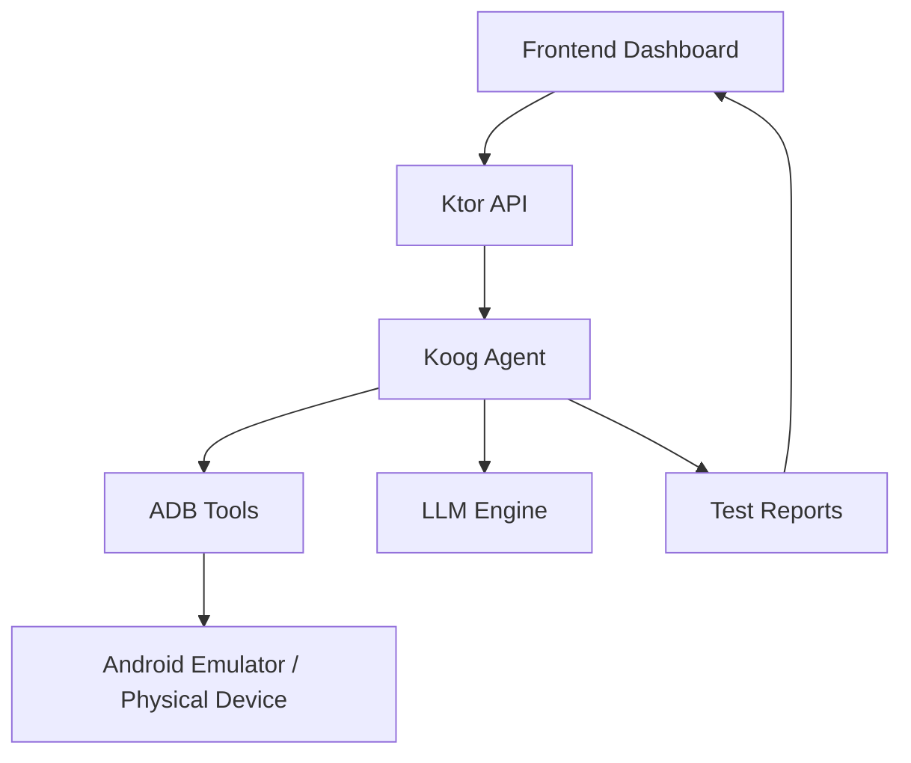

# 🤖 Mobile Tester Agent

The **Mobile Tester Agent** is an **AI-powered test automation tool** built with [Koog](https://github.com/JetBrains/koog). It allows developers to run automated tests on Android apps using **LLM-based agents**.

---

## 📂 Repositories

* **Core Agent (Koog + Ktor API):** [mobile-tester-agent](https://github.com/maikotrindade/mobile-tester-agent)
* **Frontend Dashboard:** [mobile-tester-agent-frontend](https://github.com/maikotrindade/mobile-tester-agent-frontend)
* **Sample Android App:** [mobile-tester-agent-sample-app](https://github.com/maikotrindade/mobile-tester-agent-sample-app)

---

## 🎯 Project Goal

* Automate **Android app testing** using AI.
* Interpret natural language **test scenarios** with **LLMs** (Gemini, GPT, LLaMA, etc.).
* Execute tests on an **Android Emulator or Physical Device** via **ADB**.
* Generate **reports** for developers and QA teams.
* Provide a **web dashboard** for configuring tests and visualizing results.

---

## 🏗️ Architecture

---

## 🔄 Workflow

1. **User Input (Frontend):** Define goals, steps, and agent settings.
2. **Ktor API:** Sends scenarios to the **Koog Agent**.
3. **Koog Agent:**

   * Uses an LLM to parse steps.
   * Executes actions via **ADB**.
4. **Device Execution:** Runs tests on emulator/physical device.
5. **Report Generation:** Results are returned to the **frontend dashboard**.

---

## 🖥️ Components

* **Frontend Dashboard** → Create test scenarios, configure AI, view reports.
* **Ktor API** → Orchestrates communication between frontend and agent.
* **Koog AI Agent** → Uses LLMs for reasoning, planning, and execution.
* **ADB Tools** → Executes actions on the device.
* **Android Device/Emulator** → Runs the target app under test.

---

## 📊 Example Test Scenario

**Goal:** Test the login functionality.

**Steps:**

1. Open app
2. Enter username/password
3. Click login
4. Verify success message

The agent interprets this scenario, executes steps via ADB, collects logs/screenshots, and generates a report.

---

## 🚀 Future Improvements

* Accessibility testing.
* Parallel multi-device testing.
* iOS support.

---

## 📎 References

* [Koog Documentation](https://docs.koog.ai)
* [ADB Documentation](https://developer.android.com/studio/command-line/adb)
* [Ktor Framework](https://ktor.io)

---
