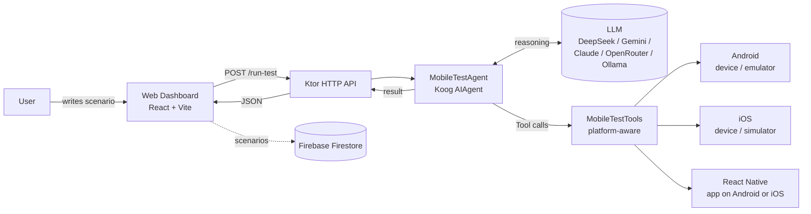

# Mobile Tester Agent

AI-powered UI test automation for **Android, iOS, and React Native** — author scenarios in natural language, let a [Koog](https://docs.koog.ai)-powered LLM agent drive a real device or emulator.


---

## Get Started

**Prerequisites:** JDK 21, Android Platform Tools (`adb`), Node 18+ for the dashboard, one LLM API key (DeepSeek, Gemini, Claude, OpenRouter, or local Ollama).

```bash
# 1. Configure environment
cp .env.example .env          # then fill in at least one LLM key + HOME_PATH

# 2. Start the backend (port 8080)
./gradlew run

# 3. Start the dashboard (optional, port 5173)
cd web && npm install && npm run dev
```

Trigger a test scenario:

```bash
curl -X POST http://localhost:8080/run-test \
  -H "Content-Type: application/json" \
  -d '{
    "goal": "Verify the login flow",
    "packageName": "io.githib.maikotrindade.appfortesting",
    "steps": [
      "Tap Login",
      "Enter username test@example.com",
      "Enter password hunter2",
      "Tap Submit",
      "Verify Profile screen is visible"
    ]
  }'
```

> `packageName` is the platform-native identifier — Android package id, iOS bundle id, or the bundle of a React Native app.
Full walkthrough: [docs/getting-started.md](docs/getting-started.md).

---

## Architecture

A Kotlin/Ktor server receives a scenario, a Koog `AIAgent` reasons step-by-step, and a platform-aware tool layer drives the device under test.


```mermaid
flowchart LR
    U[User] -->|writes scenario| FE[Web Dashboard<br/>React + Vite]
    FE -->|POST /run-test| API[Ktor HTTP API]
    API --> AGENT[MobileTestAgent<br/>Koog AIAgent]
    AGENT <-->|reasoning| LLM[(LLM<br/>DeepSeek / Gemini /<br/>Claude / OpenRouter / Ollama)]
    AGENT -->|Tool calls| TOOLS[MobileTestTools<br/>platform-aware]
    TOOLS --> AND[Android<br/>device / emulator]
    TOOLS --> IOS[iOS<br/>device / simulator]
    TOOLS --> RN[React Native<br/>app on Android or iOS]
    AGENT -->|result| API
    API -->|JSON| FE
    FE -.->|scenarios| FS[(Firebase Firestore)]
```

Detailed design lives in [docs/](docs/):

| Doc | What it covers |
|---|---|
| [Architecture](docs/architecture.md) | Runtime topology, request lifecycle, module map |
| [Getting Started](docs/getting-started.md) | Prerequisites, env vars, first test run |
| [HTTP API](docs/api.md) | `POST /run-test`, `POST /config`, payloads and errors |
| [AI Agent](docs/ai-agent.md) | Strategy graph, system prompt, LLM executors |
| [Tools](docs/tools.md) | Full `MobileTestTools` catalog and ADB/UiAutomator utilities |
| [Frontend (web)](docs/frontend.md) | React 19 + Vite dashboard, theming, i18n, Firestore |
| [Dependencies](docs/dependencies.md) | Every third-party library used in backend and frontend |

---

## References

- [Koog Documentation](https://docs.koog.ai) — the agentic framework powering the LLM ↔ tool loop
- [Building an Agentic AI Mobile Tester with Koog and Kotlin](https://maikotrindade.com/ai/kotlin/android/development/agents/2025/08/19/building-agentic-ai-mobile-tester-koog-kotlin.html) — the blog post behind this project
- [mobile-tester-agent-sample-app](https://github.com/maikotrindade/mobile-tester-agent-sample-app) — sample Android app under test
- [How to Actually Test Autonomous AI Agents](https://maikotrindade.com/ai-agents/testing/2026/05/20/testing-autonomous-ai-agents.html)
---

## License

Released under the [MIT License](LICENSE). © 2026 Maiko Trindade.
