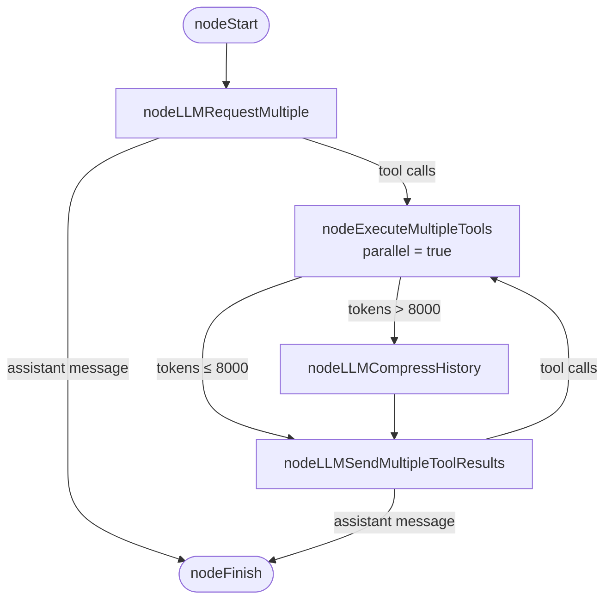

# AI Agent

This is the heart of the system. A [Koog](https://docs.koog.ai) `AIAgent` reasons over the natural-language scenario, calls tools to act on the device, verifies state, and emits a final PASS/FAIL summary. The same agent runs scenarios across **Android, iOS, and React Native** — the platform-aware tool layer hides the per-OS differences from the reasoning loop. This page covers:

1. The `MobileTestAgent` singleton
2. The Koog **strategy graph**
3. The **system prompt** and why each clause exists
4. The pluggable **LLM executors**
5. The runtime **configuration** surface

---

## 1. `MobileTestAgent`

[agent/MobileTestAgent.kt](../src/main/kotlin/agent/MobileTestAgent.kt) is a Kotlin `object` (process-wide singleton). It holds the mutable `MobileTesterConfig` and exposes:

```kotlin
suspend fun runAgent(goal: String, packageName: String, steps: List<String>): String
fun updateConfiguration(newConfig: MobileTesterConfig)
```

`runAgent` does the following on every request:

1. **Builds an `AIAgentConfig`** with:
   * a `prompt("mobileTester", LLMParams(temperature = …))` carrying the system message,
   * `model = config.executorInfo.llmModel`,
   * `maxAgentIterations = config.maxAgentIterations`.
2. **Assembles a `ToolRegistry`** with `MobileTestTools()` + reporting `ReportingTools()`. Reflection-based `@Tool` discovery means new tools are picked up automatically — see [tools.md](tools.md).
3. **Instantiates the Koog `AIAgent`** with the chosen executor, the shared [TestingStrategy](../src/main/kotlin/agent/strategy/TestingStrategy.kt), the config, and the registry.
4. **Installs event handlers** via Koog's `handleEvents` feature: agent-starting log, per-tool-call log, failure log, and a `CompletableDeferred<String>` completion hook that captures the final result.
5. **Builds the scenario text** (Goal + App package + numbered steps) and calls `agent.run(testScenario)`.
6. **Awaits** the deferred and returns the result string.

### Why a singleton?

`POST /config` mutates configuration and must persist across `POST /run-test` calls without rebuilding state — the singleton + the `var config` field is the simplest fit. Each test run still creates a fresh `AIAgent` instance, so there's no cross-run state leakage in the agent itself.

---

## 2. The strategy graph

Koog's `strategy<Input, Output>` DSL builds a directed graph of typed nodes. Ours is in [agent/strategy/TestingStrategy.kt](../src/main/kotlin/agent/strategy/TestingStrategy.kt):



### Node-by-node

| Node | Built-in Koog helper | Purpose |
|---|---|---|
| `nodeCallLLM` | `nodeLLMRequestMultiple()` | Ask the LLM what to do next; can return multiple tool calls |
| `nodeExecuteToolMultiple` | `nodeExecuteMultipleTools(parallelTools = true)` | Run tool calls concurrently when the LLM batches them |
| `nodeCompressHistory` | `nodeLLMCompressHistory<List<ReceivedToolResult>>()` | Summarize older turns to keep within context |
| `nodeSendToolResultMultiple` | `nodeLLMSendMultipleToolResults()` | Feed tool outputs back to the LLM |

### Why a token threshold of 8000?

The constant is named `MAX_TOKENS_THRESHOLD` and set to **8000** with an explanatory comment:

> The previous value (1000) triggered compression on virtually every tool call, destroying step-by-step memory.

Compression is destructive — earlier turns are summarized — so kicking it off too aggressively makes the agent forget *which step it's on*. 8000 is a pragmatic balance: high enough to preserve recent reasoning across ~10–20 tool calls, low enough to head off context-window overflow on small models.

---

## 3. The system prompt

The full text lives inline in [MobileTestAgent.kt](../src/main/kotlin/agent/MobileTestAgent.kt). The structure was tuned to make the LLM behave deterministically when it can, and recover gracefully when it can't.

### Lifecycle (strict)

1. **First action:** `startTestingScenario(appPackage)` — passing the *exact* `App package` from the user message. Connects ADB, force-stops stale instances, launches the package, verifies foreground. If it returns `OK`, the app is on screen — the model is forbidden from tapping launcher/home icons to "open" it (a common LLM failure mode).
2. **Execute each step in order**, one at a time, starting from the current screen.
3. **Final action:** `closeApp` once.
4. **Emit a single assistant message** listing each step as `PASS`/`FAIL` with a one-line reason.

### Per-step loop: act → verify → recover

* **Act**: smallest tool action that advances the step.
* **Verify**: `verifyElementVisible` (or `verifyElementNotVisible` for transitions). Never assume the action worked from its return string alone.
* **Recover on verify failure**:
  * `NOT_VISIBLE` → try `swipeUp` / `swipeDown` / `wait(500)`, then verify again.
  * `NOT_FOUND` → vary the selector (synonyms, case, partial text) or switch `selectorType`.
  * `AMBIGUOUS` → retry `tap` with `position=1, 2, …`; **don't** re-search with different text.
* Don't repeat the same failing action more than **twice**. After that, mark the step `FAIL` and continue.

### Selector strategy

Most → least reliable: `resource-id > content-desc > text`. The model is told to pass `selectorType` when it knows which attribute applies; default is `any` (matches all three).

### Tool result convention

Every tool returns a string starting with one of:

```
OK | TAPPED | VISIBLE | NOT_VISIBLE | NOT_FOUND | AMBIGUOUS | ERROR | TIMEOUT
```

The model parses this prefix to decide its next action. This is a deliberate choice — see [architecture.md §5](architecture.md#5-why-this-shape).

### Anti-patterns called out explicitly

* Don't call `startTestingScenario` more than once.
* Don't tap the launcher/home screen to open the target app.
* Don't call `closeApp` between steps.
* Don't loop the same failing call more than twice.
* Don't skip verification.
* Don't invent selectors not seen on screen — call `findUiElementsByText` or `getScreenDump` first.

### Termination

Stop only after `closeApp` + the final summary message. Format:

```
Step 1: PASS — <one-line reason>
Step 2: FAIL — <one-line reason>
...
```

---

## 4. LLM executors

An `ExecutorInfo` ties together a Koog `PromptExecutor` and an `LLModel`. Interface:

```kotlin
// agent/executor/ExecutorInfo.kt
interface ExecutorInfo {
    val executor: PromptExecutor
    val llmModel: LLModel
}
```

All concrete implementations live under [agent/executor/](../src/main/kotlin/agent/executor/). Selected at runtime by `POST /config` (see [api.md](api.md#post-config)).

| ID (`executorInfoId`) | Class | Model | API key env var |
|---|---|---|---|
| `gemini` | `GeminiExecutor` | `GoogleModels.Gemini2_5Flash` | `GEMINI_API_KEY` |
| `deepseek` | `DeepSeekExecutor` | `DeepSeekModels.DeepSeekChat` | `DEEP_SEEK_KEY` |
| `haiku` | `HaikuExecutor` | `AnthropicModels.Haiku_4_5` | `CLAUDE_API_KEY` |
| `open_router` | `OpenRouterExecutor` | `OpenRouterModels.GPT4` | `OPEN_ROUTER` |
| `ollama_llama` | `OllamaLlamaExecutor` | `OllamaModels.Meta.LLAMA_3_2_3B` | — (local) |
| `ollama_gwen` | `OllamaGwenExecutor` | `OllamaModels.Alibaba.QWEN_3_06B` | — (local) |

The default executor when the JVM starts is **`DeepSeekExecutor`** — see the default value on [MobileTesterConfig](../src/main/kotlin/agent/model/MobileTesterConfig.kt). The frontend's default selection on the Settings page is `gemini`.

### Adding a new executor

1. Create `agent/executor/MyExecutor.kt` implementing `ExecutorInfo`:
   ```kotlin
   class MyExecutor : ExecutorInfo {
       val dotenv = dotenv()
       override val executor = simpleSomeProviderExecutor(dotenv["MY_API_KEY"])
       override val llmModel = SomeProviderModels.SomeModel
   }
   ```
2. Wire it into the `when` block in [MobileTesterConfigAPI.toMobileConfig()](../src/main/kotlin/server/model/MobileTesterConfigAPI.kt).
3. (Optional) Add a `<option>` to the model dropdown in [Settings.tsx](../web/src/pages/settings/Settings.tsx).

API keys are read via [dotenv-kotlin](https://github.com/cdimascio/dotenv-kotlin) from a `.env` file at project root.

---

## 5. Runtime configuration

[MobileTesterConfig](../src/main/kotlin/agent/model/MobileTesterConfig.kt) is the in-process config:

```kotlin
data class MobileTesterConfig(
    var executorInfo: ExecutorInfo = DeepSeekExecutor(),
    var llmTemperature: Double = 0.0,
    var maxAgentIterations: Int = 80,
    var logTokensConsumption: Boolean = true
)
```

It's mutated by `POST /config` via the DTO/mapper in [MobileTesterConfigAPI.kt](../src/main/kotlin/server/model/MobileTesterConfigAPI.kt). The mapper exists so the wire format can stay simple (a string id for the executor) while the internal model carries a real `ExecutorInfo` instance.

### Field semantics

| Field | Effect |
|---|---|
| `executorInfo` | Which LLM client + model is used on the next `runAgent` call |
| `llmTemperature` | Passed to `LLMParams(temperature = …)`. `0.0` = deterministic, higher = more random |
| `maxAgentIterations` | Upper bound on reasoning iterations before Koog aborts |
| `logTokensConsumption` | Reserved for token-usage logging instrumentation |

---

## 6. Reasoning loop, end to end

Putting it together, a single `runAgent` call produces this kind of execution trace (abbreviated):

```
Starting strategy: TestingStrategy
Tool called: tool startTestingScenario, args {appPackage=io.githib.maikotrindade.appfortesting}
  → OK: launched io.githib.maikotrindade.appfortesting (foreground confirmed)
Tool called: tool findUiElementsByText, args {text=Login}
  → [UiMatchResult(value="Login", cx=540, cy=1280)]
Tool called: tool tap, args {text=Login}
  → TAPPED: (540,1280)
Tool called: tool wait, args {ms=500}
  → OK: waited 500ms
Tool called: tool verifyElementVisible, args {text=Username}
  → VISIBLE: 1 match(es) for 'Username'
... (continues for each step) ...
Tool called: tool closeApp
  → OK: App 'io.githib.maikotrindade.appfortesting' has been force-stopped.
onAgentFinished: Step 1: PASS — ... Step 2: PASS — ... etc.
```
