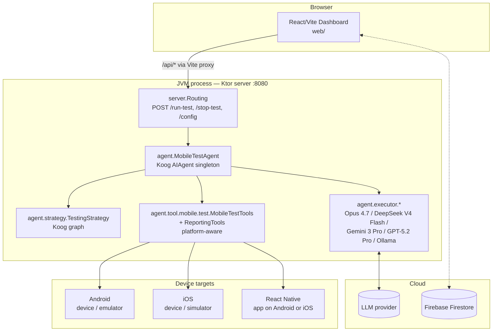
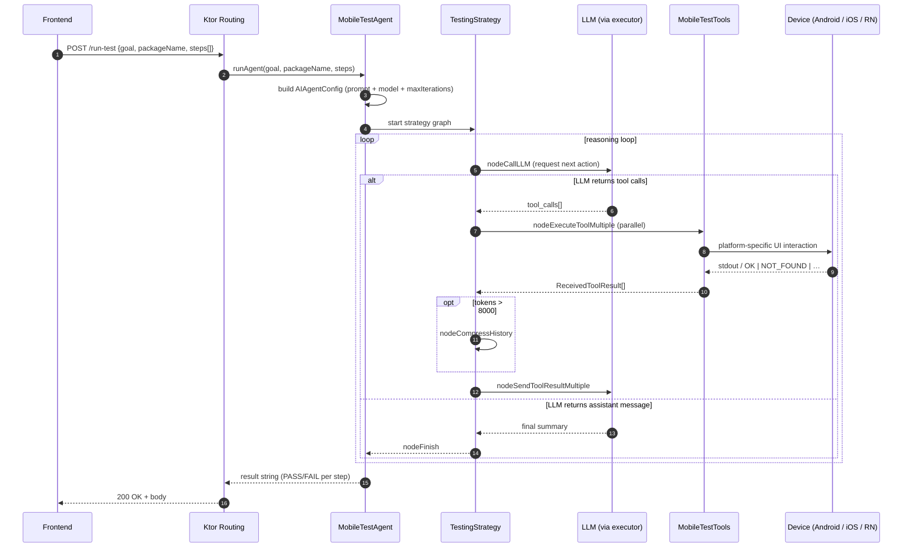

# Architecture

This page describes how the Mobile Tester Agent is wired together end-to-end: the runtime topology, the request lifecycle, and the responsibilities of each module. The agent targets **Android, iOS, and React Native** apps through a unified tool catalog.

---

## 1. Runtime topology

Three processes cooperate at runtime:



* **Frontend** runs in the browser. In development, Vite proxies `/api/*` to `http://localhost:8080` (see [vite.config.ts](../web/vite.config.ts)).
* **Backend** is a single Ktor/Netty process. The `MobileTestAgent` is a Kotlin `object` (singleton) so its config persists across requests.
* **Device targets** — physical Android devices, Android emulators, iOS devices, iOS simulators, and React Native apps running on top of either OS. The tool layer selects the right interaction primitives per platform.
* **Cloud**: the chosen LLM provider is called by the executor; Firestore stores user-authored scenarios from the dashboard.

---

## 2. Request lifecycle — `POST /run-test`



The two important loops live in the strategy:
1. **LLM → tools → LLM** until the model emits a plain assistant message.
2. **History compression** kicks in if `prompt.latestTokenUsage > MAX_TOKENS_THRESHOLD` (8000) — see [TestingStrategy.kt:11](../src/main/kotlin/agent/strategy/TestingStrategy.kt).

Per-step inside the agent's *behavior*, the system prompt mandates an **act → verify → recover** cycle: the LLM is told never to assume an action worked from the tool's return string alone, and to call `verifyElementVisible` (or `verifyElementNotVisible`) before moving on. See [ai-agent.md](ai-agent.md) for the full prompt.

---

## 3. Module map

Backend source lives under [src/main/kotlin/](../src/main/kotlin/):

```
src/main/kotlin/
├── server/
│   ├── Application.kt           # Ktor entry point (EngineMain)
│   ├── HTTP.kt                  # ContentNegotiation (kotlinx.serialization JSON)
│   ├── Monitoring.kt            # CallLogging
│   ├── Routing.kt               # POST /run-test, POST /stop-test, POST /config
│   └── model/
│       ├── AgentRequest.kt          # {goal, packageName, steps[]}
│       └── MobileTesterConfigAPI.kt # external config DTO + toMobileConfig() mapper
└── agent/
    ├── MobileTestAgent.kt       # singleton: builds & runs the Koog AIAgent
    ├── strategy/
    │   └── TestingStrategy.kt   # Koog strategy graph (LLM ↔ tools ↔ compress)
    ├── executor/
    │   ├── ExecutorInfo.kt               # interface { executor, llmModel }
    │   ├── anthropic/Opus47Executor.kt           # Claude Opus 4.7
    │   ├── deepSeek/DeepSeekV4FlashExecutor.kt   # DeepSeek V4 Flash (default)
    │   ├── google/Gemini3ProExecutor.kt          # Google Gemini 3 Pro Preview
    │   ├── openRouter/GPT52ProExecutor.kt        # OpenRouter GPT-5.2 Pro
    │   ├── ollama/QWEN36BExecutor.kt             # Local Ollama, Qwen 3 0.6B
    │   ├── ollama/Llama4Executor.kt              # Local Ollama (Groq Llama 3 tool-use 8B)
    │   └── ollama/Grok8BExecutor.kt              # Local Ollama (Groq Llama 3 tool-use 8B)
    ├── model/
    │   ├── MobileTesterConfig.kt   # internal runtime config
    │   └── TestScenarioReport.kt   # report shape (goal, steps, dates)
    └── tool/
        ├── mobile/test/
        │   ├── MobileTestTools.kt          # @Tool catalog (taps, swipes, verify, …)
        │   ├── ReportingTools.kt           # screenshots / screen recording
        │   └── utils/
        │       ├── AdbUtils.kt             # raw adb command runner + device pinning
        │       ├── UiAutomatorUtils.kt     # XML dump parser, taps, swipes
        │       ├── MediaUtils.kt           # screencap / screenrecord
        │       ├── Formatter.kt            # slugify
        │       └── UiMatchResult.kt        # data class {value, cx, cy}
        └── reporting/
            ├── ReportingTools.kt           # init/update/generate report
            └── utils/TestReportUtils.kt    # formatter for report text
```

Frontend source lives under [web/src/](../web/src/) — see [frontend.md](frontend.md) for the page-level breakdown.

---

## 4. Component responsibilities

| Component | Responsibility | Key file |
|---|---|---|
| **Ktor server** | HTTP transport, JSON (de)serialization, request logging | [server/Application.kt](../src/main/kotlin/server/Application.kt) |
| **Routing** | Validates payload, dispatches to `MobileTestAgent`, maps exceptions to HTTP codes | [server/Routing.kt](../src/main/kotlin/server/Routing.kt) |
| **MobileTestAgent** | Builds the `AIAgent`, installs event handlers (tool-call logging, completion), holds the mutable `MobileTesterConfig` | [agent/MobileTestAgent.kt](../src/main/kotlin/agent/MobileTestAgent.kt) |
| **TestingStrategy** | Defines the Koog graph: LLM ↔ tool execution ↔ history compression ↔ finish | [agent/strategy/TestingStrategy.kt](../src/main/kotlin/agent/strategy/TestingStrategy.kt) |
| **Executors** | Wire a specific LLM provider + model into the agent; read API keys from `.env` | [agent/executor/](../src/main/kotlin/agent/executor/) |
| **MobileTestTools** | The `@Tool`-annotated catalog exposed to the LLM; every method returns a status-prefixed string (`OK`, `TAPPED`, `VISIBLE`, …) the model pattern-matches on | [agent/tool/mobile/test/MobileTestTools.kt](../src/main/kotlin/agent/tool/mobile/test/MobileTestTools.kt) |
| **AdbUtils** | Builds and runs `adb` subprocesses; pins a target device serial; auto-recovers offline devices by restarting the adb server | [agent/tool/mobile/test/utils/AdbUtils.kt](../src/main/kotlin/agent/tool/mobile/test/utils/AdbUtils.kt) |
| **UiAutomatorUtils** | Calls `uiautomator dump`, parses the XML with regex, computes tap centers from bounds, performs swipes/taps | [agent/tool/mobile/test/utils/UiAutomatorUtils.kt](../src/main/kotlin/agent/tool/mobile/test/utils/UiAutomatorUtils.kt) |
| **MediaUtils** | `screencap` / `screenrecord` and pull artifacts from the device to `$HOME_PATH` | [agent/tool/mobile/test/utils/MediaUtils.kt](../src/main/kotlin/agent/tool/mobile/test/utils/MediaUtils.kt) |
| **Frontend** | Scenario CRUD (Firestore), settings UI, runs tests via the Vite dev proxy | [web/src/](../web/src/) |

---

## 5. Why this shape?

A few non-obvious design decisions worth highlighting:

* **Status-prefixed tool returns.** Every `@Tool` returns a string starting with `OK | TAPPED | VISIBLE | NOT_VISIBLE | NOT_FOUND | AMBIGUOUS | ERROR | TIMEOUT`. The LLM is told (in the system prompt) to pattern-match the prefix to decide its next move. This is far cheaper and more reliable than asking the model to interpret free-form text from `adb`. See the constant convention in [MobileTestTools.kt](../src/main/kotlin/agent/tool/mobile/test/MobileTestTools.kt).
* **Device serial pinning.** With multiple ADB devices attached, every `adb` call routes through `AdbUtils.runAdb()`, which injects `-s <serial>` after `connectDevice()` selects one. Prevents "more than one device" ambiguity errors mid-test.
* **History compression threshold = 8000 tokens.** The original 1000-token threshold caused compression on virtually every tool call, destroying step-by-step memory. See the comment in [TestingStrategy.kt:9](../src/main/kotlin/agent/strategy/TestingStrategy.kt).
* **`startTestingScenario` launches via `monkey`, then verifies foreground.** Force-stops any stale instance, wakes the screen, dismisses the keyguard, then launches with `monkey -p <pkg> -c android.intent.category.LAUNCHER 1` and re-reads `dumpsys activity top` to confirm the package is foreground. Retries once. See [AdbUtils.launchAndVerify](../src/main/kotlin/agent/tool/mobile/test/utils/AdbUtils.kt).
* **`hideKeyboard` uses `KEYCODE_BACK` (4), not `KEYCODE_ESCAPE` (111).** Empirically, ESC leaves the keyboard up on the target device; BACK dismisses it on first press. Documented inline.
