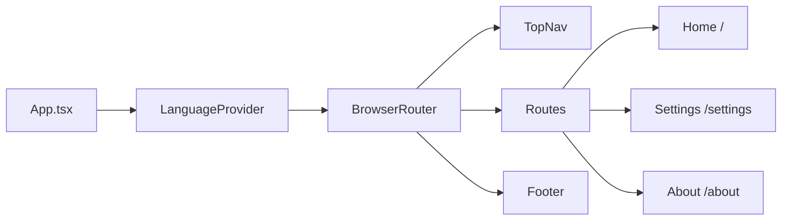

# Frontend (web)

The dashboard is a single-page React app under [web/](../web/) that lets users author test scenarios, configure the LLM, and view the system overview. It is built with **Vite + React 19 + TypeScript**, stores user-authored scenarios in **Firebase Firestore**, and talks to the Ktor backend through a Vite dev proxy.

---

## 1. Stack at a glance

| Concern | Choice |
|---|---|
| Bundler / dev server | Vite 7 |
| UI library | React 19 + react-dom |
| Routing | react-router-dom 7 (`BrowserRouter`) |
| HTTP | axios 1.11 (for `/run-test`); native `fetch` (for `/config`) |
| Persistence (scenarios) | Firebase 12 — Firestore |
| Diagrams | mermaid 11 (rendered on the About page) |
| i18n | Custom lightweight context (English / French) |
| Styling | CSS Modules per component, plus globals in `App.css` / `index.css` |
| Theming | `data-theme` attribute on `<html>` + localStorage persistence |
| Lint | eslint 9 + typescript-eslint + react-hooks/refresh plugins |

Configured in [web/package.json](../web/package.json), [web/vite.config.ts](../web/vite.config.ts), [web/tsconfig.json](../web/tsconfig.json), [web/eslint.config.js](../web/eslint.config.js).

---

## 2. Routes

Defined in [web/src/App.tsx](../web/src/App.tsx) using `react-router-dom`:

| Path | Component | Purpose |
|---|---|---|
| `/` | [Home](../web/src/pages/home/Home.tsx) | Author scenarios, list saved ones, run tests |
| `/settings` | [Settings](../web/src/pages/settings/Settings.tsx) | LLM / agent configuration |
| `/about` | [About](../web/src/pages/about/About.tsx) | System overview + mermaid architecture diagram |

The shell wraps every route in `<LanguageProvider>` → `<BrowserRouter>` → `<TopNav>` / `<main>` / `<Footer>`.



---

## 3. Home page — scenario CRUD + run

[web/src/pages/home/Home.tsx](../web/src/pages/home/Home.tsx)

### State

* `testGoal` — the high-level objective the LLM optimises for
* `steps[]` — ordered `{ id, description }` items the user adds, edits, removes
* `scenarios[]` — all scenarios in Firestore (live-subscribed via `onSnapshot`)
* `currentScenarioId` — which Firestore document is currently being edited
* `isLoading`, `error`, `success` — UI affordances

### Firestore wiring

```ts
const scenariosCollection = collection(db, 'testScenarios');
useEffect(() => {
  const unsubscribe = onSnapshot(scenariosCollection, (snap) => {
    setScenarios(snap.docs.map(/* shape into TestScenario */));
  });
  return () => unsubscribe();
}, []);
```

`db` is the Firestore instance from [web/src/firebase.ts](../web/src/firebase.ts), initialised with Vite env vars `VITE_FIREBASE_*`.

### Auto-save

An effect on `[testGoal, steps]` upserts to Firestore. New scenarios call `addDoc`; existing ones call `updateDoc(doc(db, 'testScenarios', currentScenarioId), ...)`. A brief `Auto-saved!` toast confirms.

### Running a test

`handleRunTest` posts to `/api/run-test`:

```ts
const payload = {
  goal: testGoal,
  packageName: localStorage.getItem('packageName') || 'io.githib.maikotrindade.appfortesting',
  steps: steps.map(s => s.description),
};
await axios.post('/api/run-test', payload, {
  headers: { 'Content-Type': 'application/json' },
  timeout: 3 * 60_000,
  withCredentials: false,
});
```

The 3-minute timeout matches typical full-scenario runtimes. Error handling distinguishes `ECONNABORTED` (timeout), `ERR_NETWORK`, server-with-body, and request-without-response cases — all surfaced via translated strings (see §6).

---

## 4. Settings page

[web/src/pages/settings/Settings.tsx](../web/src/pages/settings/Settings.tsx) maintains six settings, all persisted to `localStorage` and (where applicable) pushed to the backend via `POST /api/config`:

| Setting | Default | Sent to backend? |
|---|---|---|
| `executorInfoId` | — (must select) | ✅ |
| `llmTemperature` | `0.2` | ✅ |
| `maxAgentIterations` | `50` | ✅ |
| `logTokensConsumption` | `true` | ✅ |
| `apiBaseUrl` | `http://localhost:8080` | (frontend only) |
| `packageName` | `io.githib.maikotrindade.appfortesting` | (frontend only, used by Home when running tests) |

Model dropdown options:

```
open_router  → Open Router GPT-4
ollama_gwen  → Ollama Gwen 3.0 6B
gemini       → Gemini 2.0 Flash
ollama_llama → Ollama LLaMA 3.2 3B
```

> Note: the dropdown does not yet list `haiku` or `deepseek` despite the backend accepting them. Add `<option>`s to expose them.

`handleSave` writes everything to `localStorage`, then `fetch`-POSTs to `/api/config` and reports success/failure via a translated message.

---

## 5. About page — system overview

[web/src/pages/about/About.tsx](../web/src/pages/about/About.tsx) describes the project and renders a Mermaid diagram of the architecture:

```
graph TD
    A[Frontend] --> B[Backend API]
    B --> C[Koog Agent]
    C --> D[ADB]
    D --> E[Android Device]
    C --> G[LLM]
    C --> H[Reports]
    H --> A
```

Mermaid is initialised with a custom `themeVariables` palette per theme. A small effect re-runs `mermaid.run()` whenever `theme` changes, re-rendering with the matching palette.

---

## 6. Internationalisation (i18n)

A minimal, no-dependency i18n layer lives in [web/src/i18n/](../web/src/i18n/):

* **[translations.ts](../web/src/i18n/translations.ts)** — two flat objects `en` and `fr: typeof en`. Using `typeof en` guarantees the French object exposes the same keys at compile time.
* **[useLanguage.ts](../web/src/i18n/useLanguage.ts)** — defines `LanguageCtx`, `LANGUAGE_STORAGE_KEY`, `getInitialLanguage()` (reads `localStorage`, falls back to `navigator.language`), and a `useLanguage()` hook that throws if used outside the provider.
* **[LanguageContext.tsx](../web/src/i18n/LanguageContext.tsx)** — the `LanguageProvider` and the `t()` function. `t('home.testGoalLabel')` walks the dotted key path. Variables interpolate via `{name}` placeholders: `t('home.errServer', { status: 500, message: 'boom' })`.

Switching language is a button in `TopNav` that toggles `en ↔ fr`. The current language is mirrored to `<html lang="…">` and persisted to `localStorage`.

---

## 7. Theming

[web/src/useTheme.ts](../web/src/useTheme.ts) implements light/dark switching:

* Initial value: `localStorage.theme`, falling back to `prefers-color-scheme`.
* Effect mirrors `theme` to `<html data-theme="…">` and `localStorage`.
* `toggleTheme()` flips `light ↔ dark`.

Component CSS Modules can then key off `[data-theme="dark"]` selectors.

---

## 8. Layout chrome

* **[TopNav](../web/src/TopNav.tsx)** — nav links (Home / Settings / About), GitHub icon, language toggle, theme toggle. Active route gets the `.active` class via `NavLink`'s render-prop.
* **[Footer](../web/src/Footer.tsx)** — `made with ❤️ by Maiko Trindade` (translated).

---

## 9. Dev proxy → backend

[web/vite.config.ts](../web/vite.config.ts) sets up a single proxy so the frontend can pretend to be same-origin:

```ts
server: {
  proxy: {
    '/api': {
      target: 'http://localhost:8080',
      changeOrigin: true,
      rewrite: (path) => path.replace(/^\/api/, '')
    }
  }
}
```

In the browser, fetches go to `/api/run-test`; Vite forwards them to `http://localhost:8080/run-test`. This sidesteps CORS for local dev.

For deployments, either:
* host the frontend behind the same origin as the backend (recommended), or
* enable CORS on Ktor and let the Settings page's `apiBaseUrl` point at the backend host.

---

## 10. Project structure

```
web/
├── index.html                       # Vite entry HTML
├── package.json
├── tsconfig.json / tsconfig.app.json / tsconfig.node.json
├── vite.config.ts                   # /api → :8080 proxy
├── eslint.config.js
└── src/
    ├── main.tsx                     # createRoot + <App />
    ├── App.tsx                      # router shell
    ├── App.css / index.css          # globals
    ├── firebase.ts                  # Firestore init from VITE_FIREBASE_*
    ├── useTheme.ts                  # light/dark hook
    ├── TopNav.tsx / TopNav.module.css
    ├── Footer.tsx / Footer.module.css
    ├── i18n/
    │   ├── translations.ts          # en / fr dictionaries
    │   ├── useLanguage.ts           # context + hook + storage helpers
    │   └── LanguageContext.tsx      # provider + t() impl
    └── pages/
        ├── home/Home.tsx + .module.css
        ├── settings/Settings.tsx + .module.css
        └── about/About.tsx + .module.css
```

---

## 11. Required env vars

Add to `web/.env.local` (Vite reads `VITE_*` automatically):

```
VITE_FIREBASE_API_KEY=...
VITE_FIREBASE_AUTH_DOMAIN=...
VITE_FIREBASE_PROJECT_ID=...
VITE_FIREBASE_STORAGE_BUCKET=...
VITE_FIREBASE_MESSAGING_SENDER_ID=...
VITE_FIREBASE_APP_ID=...
```

Without these, `firebase/app` will throw on init and the Home page won't be able to subscribe to scenarios.

---

## 12. Scripts

From [web/package.json](../web/package.json):

| Script | Action |
|---|---|
| `npm run dev` | Start Vite dev server (default port 5173) with the `/api` proxy |
| `npm run build` | `tsc -b && vite build` — type-check then bundle into `web/dist/` |
| `npm run preview` | Serve the built bundle locally |
| `npm run lint` | Run ESLint over the workspace |
